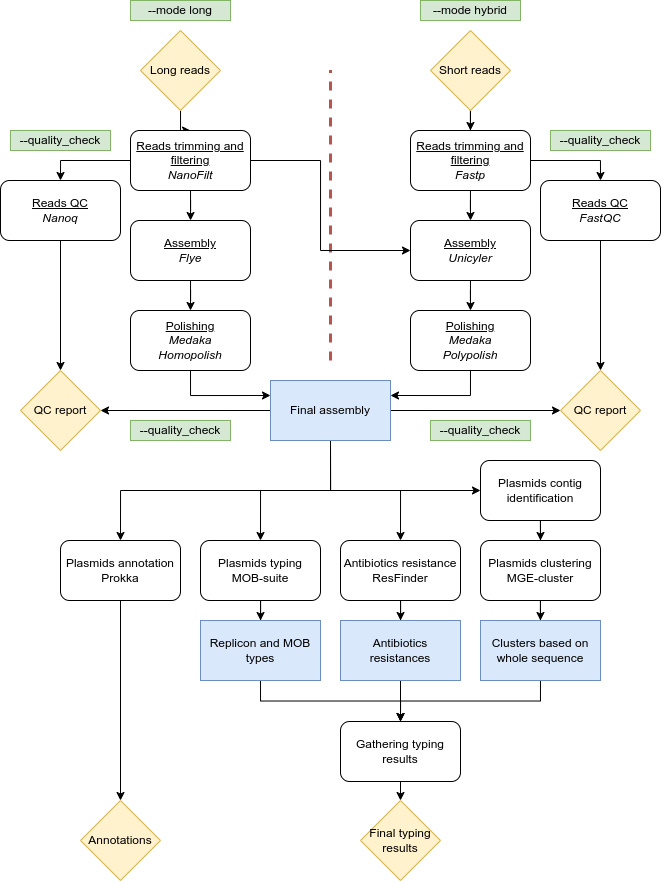

# NanoPlasm
v1.0  

NanoPlasm is a workflow designed for the purpose of assembling, typing, and analyzing plasmid sequences using Nanopore long reads, as well as a combination of long and short reads. To ensure reliability, reproducibility, and optimization in the analysis process, NanoPlasm harnesses the power of the Snakemake workflow framework.

## Workflow overview

## Install

In order to install and use NanoPlasm, you will need to clone this repository and install dependencies as outlined below.

    # Clone NanoPlasm repository
    git clone https://github.com/Flomauf/NanoPlasm.git NanoPlasm

## Dependencies

While NanoPlasm relies on Docker images for the majority of its tools, certain dependencies must be installed beforehand to ensure seamless execution. It is strongly recommended to set up a dedicated environment specifically for this purpose. The subsequent instructions illustrate how to achieve this using Conda:  

    # Create the environment
    conda create -n nanoplasm  python=3.10.0
    # Install dependencies
    conda install -c bioconda -c conda-forge snakemake bwa biopython mge-cluster
    # Activate the environment
    conda activate nanoplasm

## Database

In order for Homopolish to function properly, a dedicated database is necessary. This database should be installed within the NanoPlasm directory. To streamline this process, a script has been developed to simplify the installation.

    # Go into NanoPlasm directory
    cd NanoPlasm
    # Install database
    sh install_db.sh

## Usage

To ease the usage of NanoPlasm, a wrapper script has been implemented to facilitate the invocation of the Snakemake pipeline. However, if needed, arguments can still be passed to Snakemake using the --options argument, allowing for additional customization and flexibility.  

To maintain consistency and organization, it is essential to adhere to the following file naming conventions when working with NanoPlasm:

For long reads:
- Each long read file should be named as "ID.fastq", where "ID" represents a unique identifier associated with the sample.

For short reads:
- Paired-end short read files should be stored in a separate folder.
- The forward read file should be named as "ID_R1.fastq", where "ID" corresponds to the sample identifier.
- The reverse read file should be named as "ID_R2.fastq", following the same sample identifier pattern.

Adhering to these file naming conventions ensures clarity and facilitates the organization of data within the NanoPlasm workflow.

### Creation of the analysis folder

The initial step consists in creating the analysis folder. Within it, an automatically generated configuration file will be created, encompassing all the parameters required for the analysis. It is imperative to edit this file in accordance with your specific analysis requirements and preferences.

    usage: nanoplasm init [-h] -i dir [-I dir] -o dir

    Generate the folder and configuration file for NanoPlasm analysis.

    options:
    -h, --help            show this help message and exit
    -i dir, --input dir   directory with Nanopore fastq files. Files must be in the following format: ID.fastq
    -I dir, --INPUT dir   directory with Illumina fastq files. Files must be in the following format: ID_R#.fastq
    -o dir, --output dir  directory to create for the run

### Starting NanoPlasm run

After creating the analysis folder, you can initiate a NanoPlasm run. The workflow offers two distinct assembly modes: "long" and "hybrid."

- "long" mode: This mode is specifically designed for Nanopore long-read sequencing data. It focuses on leveraging the unique characteristics of long reads to perform the plasmid assembly, typing, and analysis.

- "hybrid" mode: In this mode, a combination of long and short reads is utilized. The workflow harnesses the strengths of both long and short reads to achieve more comprehensive and accurate results in plasmid assembly, typing, and analysis.

You can select the appropriate assembly mode based on the sequencing data available for your analysis.

    usage: nanoplasm typing [-h] [-m dir] -d dir [-t int] [--quality_check] [--options str]

    Start Nanoplasm with long|hybrid mode.

    options:
    -h, --help            show this help message and exit
    -m dir, --mode dir    mode for assembling genomes [long]
    -d dir, --dir dir     directory for the run (created with nanoplasm init)
    -t int, --thread int  number of threads [1]
    --quality_check       enable reads quality check [disabled]
    --options str         Snakemake options. Use as --options= and snakemake arguments between brackets

### Example

    # Generate the analysis folder and configuration file
    path/to/nanoplasm init -i fastq_nanopore -o analysis_folder
    # Edit the configuration file
    nano analysis_folder/config.yaml
    # Start NanoPlasm run
    path/to/nanoplasm typing -d analysis_folder -t 24 --quality_check

- The pipeline might crash because a sample assembly failed.  
This can be due to a very low coverage for this sample leading Flye to fail disjointing assembly. To avoid this error, you can use the --asm-coverage and --genome-size options in Flye to limit the coverage in your assemblies. Add these options in the config.yaml file of the run.
- You need to analyse groups of sample with different parameters and you want to compare them all together ultimately.  
Run the analyses in different folders with appropriate parameters for each analysis and, once all analyses are completed, merge all folders using the merge function.